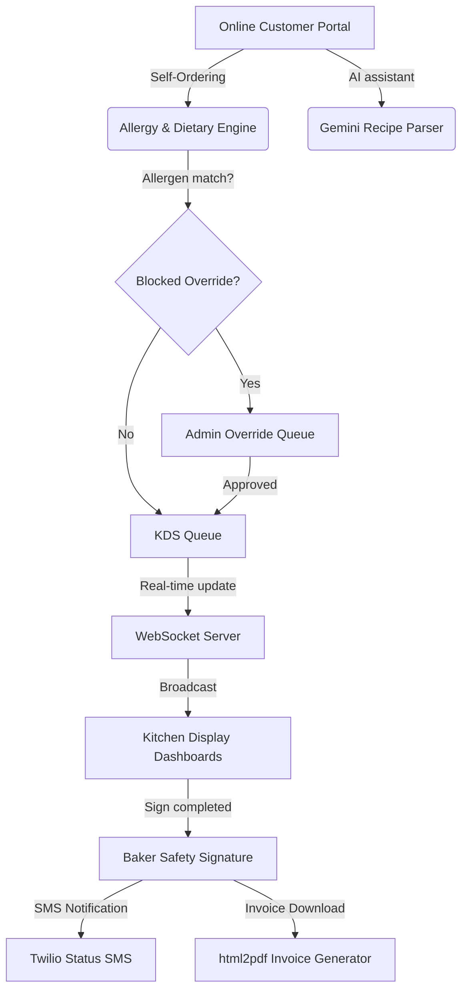

# 🎂 Cakes & Crunches — Premium Bakery Safety & KDS Management

Cakes & Crunches is a premium, real-time bakery operations management system designed to enforce allergen safety, automate kitchen workflows, and provide executive analytics. It integrates dynamic database-driven dietary locks, Gemini AI recipe parsing, real-time WebSocket notifications, and supervisor double-signature overrides.

---

## 🌟 Key Features

### 1. 🛡️ Advanced Safety & Allergy Guardrails
*   **Gemini AI Recipe Parsing:** Customers can write recipes in natural language (e.g. *"I want a keto cake with strawberries, almond flour, and sugar-free chocolate"*), and the system extracts structured ingredient tokens using the Gemini API.
*   **Database-Driven Dietary Checks:** Automatic ingredient checking against SQLite-driven customer profiles (e.g., locking ingredients like eggs or gelatin for Vegan/Jain dietary selections).
*   **Supervisor Override:** High-risk allergen matches automatically block production, routing the order to the Admin's queue for override approval.

### 2. 🔌 Real-Time Kitchen Display System (KDS)
*   **Instant Updates:** Powered by **Socket.io**; order placements, cancellations, and status changes sync immediately across all connected dashboards without manual refreshes.
*   **Double-Signature Sign-off:** High-risk allergy orders cannot be marked as completed or delivered without capturing a final Baker verification signature confirming sanitation compliance.
*   **Preparatory Checklists:** Dynamic checklist items for bakers to confirm sanitation, tool cleanliness, and allergy-free preparation.

### 3. 📊 Reports & Executive Analytics
*   **Interactive Metrics & Charts:** Rich data visualizations (Recharts) detailing revenue trends, allergen distributions, and popular categories.
*   **Tabular Data Exporter:** One-click landscape PDF document print generator and CSV spreadsheets downloads.

---

## 🏗️ System Architecture



---

## 🛠️ Technology Stack

*   **Frontend:** React (Vite), TailwindCSS, Lucide Icons, Recharts, Framer Motion, HTML5 Canvas, Socket.io-client.
*   **Backend:** Node.js, Express, Socket.io, SQLite (with `PRAGMA foreign_keys = ON`), JSON Web Tokens (JWT), Axios, bcryptjs.
*   **Third-party APIs:** Gemini Pro API (AI recipe parsing), Twilio SDK (order status SMS updates).

---

## 🚀 Quick Start Guide

### Prerequisites
Make sure you have [Node.js](https://nodejs.org/) (v16+) installed.

### 1. Backend Setup
1. Navigate to the backend directory:
   ```bash
   cd backend
   ```
2. Install dependencies:
   ```bash
   npm install
   ```
3. Set up environment variables:
   Create a `.env` file in the `backend/` directory:
   ```env
   PORT=5000
   JWT_SECRET=CAKES_AND_CRUNCHES_JWT_SECRET_2026
   GEMINI_API_KEY=your_gemini_api_key_here
   TWILIO_ACCOUNT_SID=your_twilio_sid_here
   TWILIO_AUTH_TOKEN=your_twilio_token_here
   TWILIO_PHONE_NUMBER=your_twilio_phone_number_here
   ```
4. Run in development mode:
   ```bash
   npm run dev
   ```

### 2. Frontend Setup
1. Navigate to the frontend directory:
   ```bash
   cd ../frontend
   ```
2. Install dependencies:
   ```bash
   npm install
   ```
3. Run the development server:
   ```bash
   npm run dev
   ```
   Open your browser to [http://localhost:3000](http://localhost:3000).

---

## 🔑 Test Credentials

Use these credentials to log in to the administrative/staff workspace:
*   **Email:** `gnanasaib2008@gmail.com`
*   **Password:** `Gnanasai@2008`
